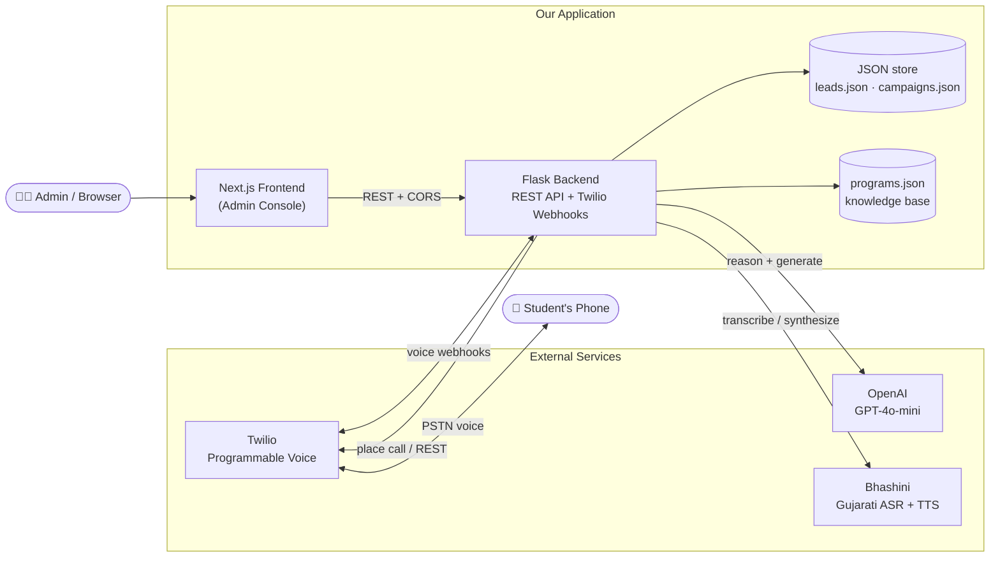
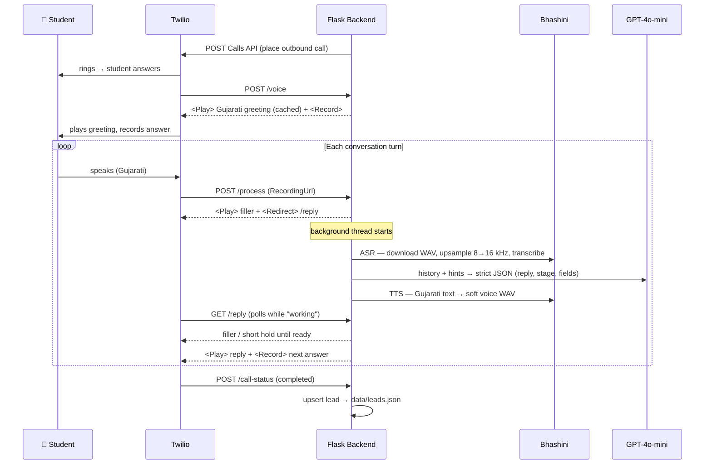
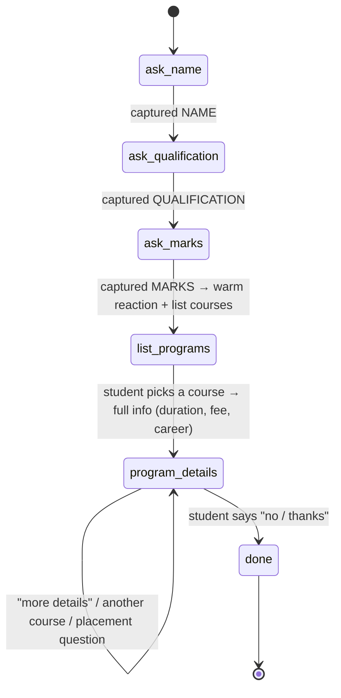
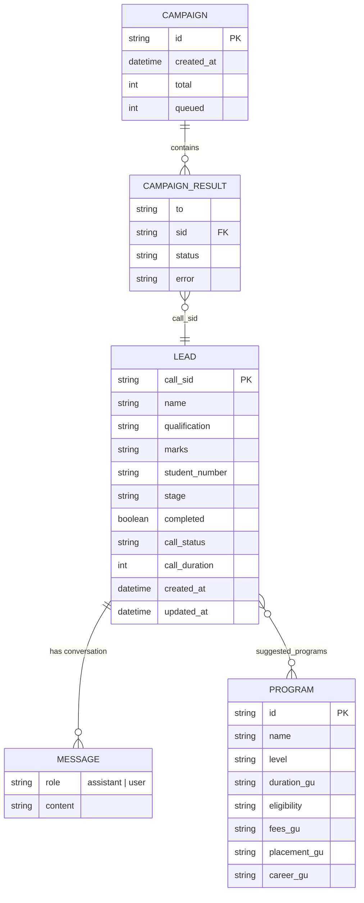

# AI Voice Admission Counsellor — Darshan University

An AI-powered **voice** admission counsellor. A student receives a phone call, and
an AI agent talks to them **in Gujarati** — it greets them, asks their **name**,
**latest qualification** and **marks**, then lists and explains the matching
**Darshan University** degree programs (duration, eligibility, fees, placement),
answers follow-up questions, and logs everything as a lead.

The system has a **telephony voice pipeline** (Twilio + Bhashini + GPT‑4o‑mini) and
a **web admin console** (Next.js) for dialing, campaigns, leads, analytics and call
logs.

---

## Table of Contents
1. [Technology Stack Used](#1-technology-stack-used)
2. [System Architecture](#2-system-architecture)
3. [Application Flow Diagram](#3-application-flow-diagram)
4. [ER Diagram](#4-er-diagram)
5. [Paid Services and Cost Details](#5-paid-services-and-cost-details)
6. [Other Relevant Technical Information](#6-other-relevant-technical-information)

---

## 1. Technology Stack Used

| Layer | Technology | Purpose |
|---|---|---|
| **Telephony** | **Twilio** Programmable Voice | Places outbound calls, streams TwiML (`<Play>`, `<Record>`, `<Pause>`, `<Redirect>`, `<Hangup>`), delivers webhooks |
| **Speech (STT + TTS)** | **Bhashini** (MeitY / ULCA, Dhruva inference API) | Gujarati **ASR** (speech→text) and **TTS** (text→speech) |
| **Language model** | **OpenAI GPT‑4o‑mini** | Understands the student, drives the conversation state machine, generates Gujarati replies (strict JSON output) |
| **Backend** | **Python 3.13 · Flask** | REST API + Twilio webhooks + orchestration |
| **Backend (prod server)** | **Gunicorn** (`--workers 1 --threads 8`) | Production WSGI server on Render |
| **Concurrency** | Python `threading` | Per-turn processing runs in a background thread while a filler plays |
| **Audio processing** | Pure Python (`wave`/`struct`/`array`, `math`) | WAV parsing, 8 kHz→16 kHz upsampling for ASR, volume + low‑pass "soft voice" filter, PCM normalization |
| **Data store** | **JSON files** (`data/leads.json`, `data/campaigns.json`) | Lead + campaign persistence (file-based, no DB) |
| **Knowledge base** | `programs.json` | 10 real Darshan University programs (scraped from darshan.ac.in) |
| **Frontend** | **Next.js 14** (App Router) · **React 18** | Admin console SPA |
| **UI / Charts** | **Tailwind CSS** · **Recharts** | Styling + analytics charts |
| **Local tunnel** | **ngrok** (reserved domain) | Exposes local backend to Twilio during development |
| **Hosting** | **Render** (backend + frontend); **Vercel** (frontend alt.) | Cloud deployment |

---

## 2. System Architecture



**How the pieces fit:**
- The **Admin** uses the **Next.js frontend** to dial numbers, run campaigns, and view leads/analytics. It talks to the **Flask backend** over REST (CORS-enabled).
- The **Flask backend** is the brain: it places calls via **Twilio**, receives Twilio's **voice webhooks**, and per turn calls **Bhashini** (ASR + TTS) and **OpenAI** (reasoning). It reads the **`programs.json`** knowledge base and persists results to **JSON files**.
- **Twilio** bridges the internet and the **PSTN**, so a real phone rings and audio flows both ways.

---

## 3. Application Flow Diagram

### 3a. Per‑call voice pipeline



**Latency masking:** `/process` returns instantly with a filler ("હું જોઈ રહ્યો છું…") while the heavy work (ASR → GPT → TTS) runs in a background thread; `/reply` polls until the reply audio is ready, so the caller never hears dead silence.

### 3b. Conversation state machine (driven by GPT‑4o‑mini + code guards)



Deterministic **keyword detectors** (qualification / marks / end-intent) and an
**empty-response retry** wrap the LLM so valid Gujarati answers are never wrongly
rejected.

---

## 4. ER Diagram

The system is file-based (JSON), but the logical data model is:



- **LEAD** — one per call (keyed by Twilio `call_sid`); stores captured profile + full transcript. → `data/leads.json`
- **MESSAGE** — each turn of the conversation (embedded in the lead).
- **CAMPAIGN / CAMPAIGN_RESULT** — a bulk-dial run and its per-number outcomes; each result links back to a LEAD via `call_sid`. → `data/campaigns.json`
- **PROGRAM** — the read-only knowledge base of 10 Darshan University degrees. → `programs.json`

---

## 5. Paid Services and Cost Details

| Service | Pricing model | Approx. cost | Notes |
|---|---|---|---|
| **Bhashini** (ASR + TTS) | **Free** | **₹0** | Government of India (MeitY) service — free for Gujarati speech. Core cost advantage. |
| **OpenAI GPT‑4o‑mini** | Per token — $0.15 / 1M input, $0.60 / 1M output | **≈ $0.003–0.01 per full call** | A ~10‑turn call ≈ a fraction of a cent. Negligible. |
| **Twilio phone number** | Monthly rental | **≈ $1.15 / month** (US local number) | One number needed to place calls. |
| **Twilio outbound calls** | Per minute | **≈ $0.08–0.15 / min** (US number → India mobile) | Observed ~$0.045–0.09 for 15–60 s test calls. **Trial account gives ~$15 free credit** and can only call verified numbers. |
| **Render (hosting)** | Free tier / Starter | **$0** (free) or **$7 / month** (Starter) | Free tier has cold starts + CPU throttling; Starter recommended for live demos. |
| **Vercel (frontend, optional)** | Hobby tier | **Free** | Recommended host for the Next.js frontend. |
| **ngrok** (local dev only) | Free tier | **Free** | Only for local development, not production. |

**Estimated cost of one complete demo call ≈ ₹8–15 (~$0.10–0.18)** — almost entirely
Twilio call minutes; speech is free (Bhashini) and the LLM is negligible.

> Prices are indicative (2026) and vary by region, number type and provider plan.

---

## 6. Other Relevant Technical Information

### Project structure
```
ai-voice-counsellor/
├── app.py            # Flask app: Twilio webhooks, REST API, call orchestration
├── bhashini.py       # Bhashini client: Gujarati ASR + TTS, audio processing
├── counsellor.py     # GPT-4o-mini brain: prompt, state machine, JSON output
├── storage.py        # JSON persistence (leads + campaigns)
├── programs.json     # Knowledge base: 10 Darshan University programs
├── make_call.py      # CLI: place single / batch outbound calls
├── requirements.txt  # Python deps (flask, twilio, openai, requests, gunicorn…)
├── .env.example      # Documented environment variables (no secrets)
├── data/             # leads.json, campaigns.json (runtime; gitignored leads)
├── static/audio/     # Generated TTS/filler WAVs (runtime, gitignored)
└── frontend/         # Next.js admin console (see frontend/README.md)
    └── app/(app)/    # dashboard, dial, leads, campaign, analytics, call-logs
```

### Backend API endpoints
| Method | Route | Purpose |
|---|---|---|
| POST | `/voice` | Twilio: call connected → greeting + record |
| POST | `/process` | Twilio: caller's recording → start turn, play filler |
| GET/POST | `/reply` | Twilio: poll for the reply, then play it |
| POST | `/call-status` | Twilio: final call outcome callback |
| POST | `/call` | Place one outbound call (frontend Dial Up) |
| POST | `/campaign` | Bulk-dial a list of numbers |
| GET | `/api/stats` | Aggregates for dashboard / analytics |
| GET | `/api/campaigns` | Campaign history + live completion |
| GET | `/leads` | All captured leads (JSON) |
| GET | `/health` | Health check |

### Key design decisions
- **Bhashini "direct inference" mode** — calls the Dhruva endpoint with just an inference key (no ULCA `userID` needed), using fixed Gujarati service IDs (`ai4bharat/conformer-multilingual-indo_aryan` for ASR, `ai4bharat/indic-tts-coqui-indo_aryan` for TTS).
- **Telephony‑ASR cleanup** — Twilio records 8 kHz; the code **upsamples to 16 kHz + normalizes volume** before ASR, which dramatically improved recognition of phone audio.
- **Soft voice** — a pure‑Python **low‑pass filter + gain** over the TTS output for a gentle voice, tunable via env (`BHASHINI_TTS_GENDER/SAMPLING_RATE/VOLUME/SOFTNESS`).
- **Pronunciation fixes** — abbreviations are expanded for TTS (e.g. `B.Tech`→"બી ટેક", `CSE`→"સી એસ ઈ", `%`→"ટકા", `AI`→"આર્ટિફિશિયલ ઇન્ટેલિજન્સ").
- **Reliability guards** — deterministic keyword detection + retry on empty LLM responses stop the agent from wrongly asking the student to repeat.

### Configuration (environment variables)
Backend (`.env` / Render → Environment): `OPENAI_API_KEY`, `TWILIO_ACCOUNT_SID`,
`TWILIO_AUTH_TOKEN`, `TWILIO_FROM_NUMBER`, `BHASHINI_UDYAT_KEY`,
`BHASHINI_INFERENCE_KEY`, `DEFAULT_COUNTRY_CODE`, `PUBLIC_BASE_URL`, and optional
voice vars. Frontend: `NEXT_PUBLIC_API_BASE`. See `.env.example`.

### Run locally
```powershell
# 1) Backend
cd ai-voice-counsellor
python -m venv .venv ; .\.venv\Scripts\Activate.ps1
pip install -r requirements.txt
copy .env.example .env      # fill in keys
python app.py               # http://127.0.0.1:5000

# 2) Tunnel (so Twilio can reach it) — separate terminal
ngrok http 5000             # put the https URL in PUBLIC_BASE_URL + Twilio webhook

# 3) Frontend — separate terminal
cd frontend
npm install
npm run dev                 # http://localhost:3000  (login: admin / darshan123)
```

### Deployment (Render)
- **Backend** — Root: `ai-voice-counsellor` · Build: `pip install -r requirements.txt` · Start: `gunicorn app:app --bind 0.0.0.0:$PORT --workers 1 --threads 8`
- **Frontend** — Root: `ai-voice-counsellor/frontend` · Build: `npm install && npm run build` · Start: `npm start`
- Set env vars in the dashboard; point Twilio's Voice webhook at `<backend-url>/voice`. Region **Singapore** is closer to Bhashini (India) → lower latency.

### Known limitations
- **In‑memory call state** (`CALLS`/`PENDING`) → run a **single worker**; not horizontally scalable as-is.
- **JSON storage** and generated audio are **ephemeral on Render's free tier** (reset on redeploy) — use a DB / persistent disk for production.
- **Free‑tier latency** — cold starts + CPU throttling + US↔India distance slow each turn (mitigated by fillers; better on a paid instance / Singapore region).
- **Auth is a frontend‑only demo** (localStorage) — replace with real auth (NextAuth/JWT) for production.
- **Twilio trial** can only call verified numbers.

### Data sources
Program, fee and placement data were compiled from public listings on
[darshan.ac.in](https://darshan.ac.in/programs) and education aggregators; treat
fees/placement figures as **indicative** and confirm official numbers before real use.
